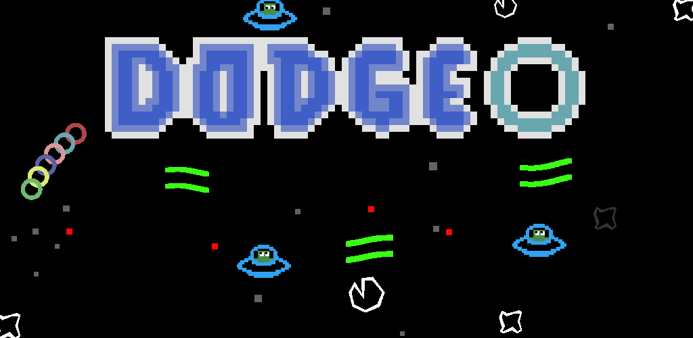

An Asteroid styled retro arcade game written in LibGDX.

### About
This was a mini project I created back in high school, as a means of learning both Java as well as the LibGDX framework. I wrote this code base years ago, and as such, it isn't great. Back then, I wasn't quite sure how to structure my project or really make use of design practises and the result of it is some poorly written code. But, it was a learning experience for me, and was one of the first ever projects I wrote to better with Java.

### Play
I did however end up publishing this to the Google Play Store but it isn't available anymore. You can play it by downloading the release APK directly. You will have to enable downloads for 3rd party APKs if you'd like to download this directly to an Android phone.